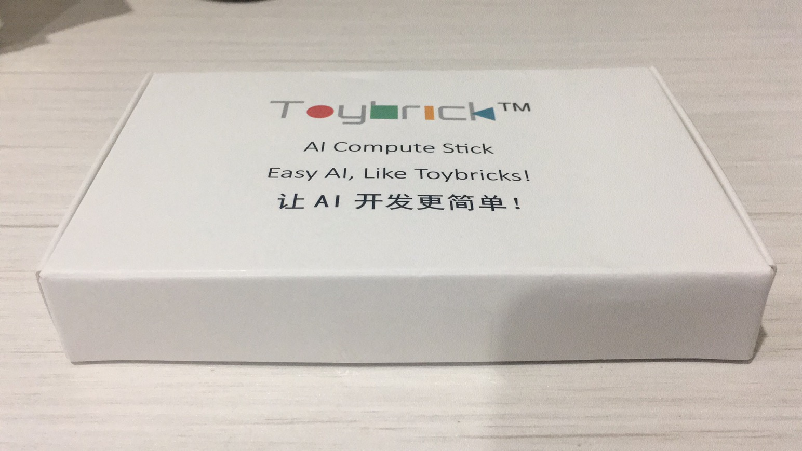
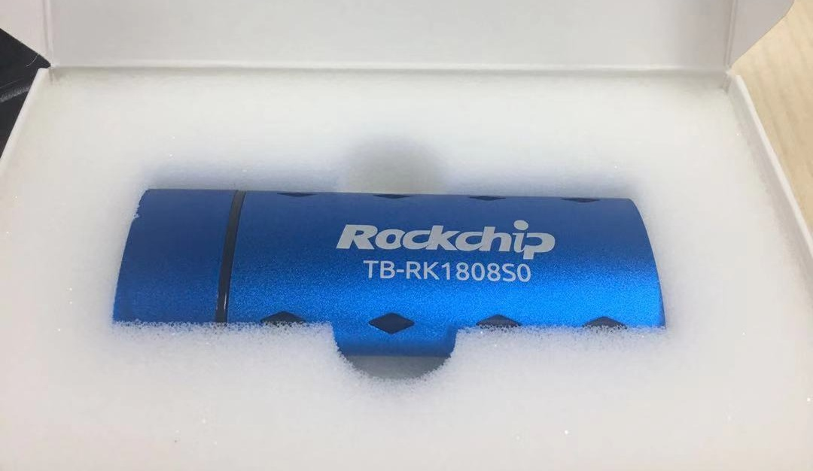
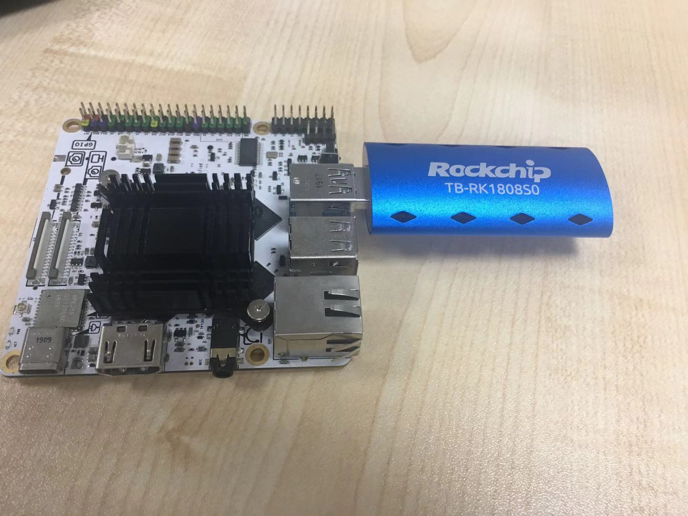

# RK1808S_AI计算棒—开箱
[TOC]

## 0、引言

> 瑞芯微RK1808人工智能计算棒
RK1808人工智能计算棒是瑞芯微旗下首款AI人工智能计算棒AI Compute Stick，内置高算力RK1808 NPU处理器，主要面向基于人工智能平台以及边缘计算产品的深度学习开发者，是具备强大的人工智能编程及深度学习能力的AI加速器。

## 1、开箱 

* 让AI开发更简单

### RK1808S计算棒正面照

* RK1808人工智能计算棒算是众多边缘计算设备中的佼佼者，外观时尚精致，尺寸只有82*31*13mm（差不多传统U盘大小）.功耗低、兼容性强；支持Windows、Linux、MacOS、Arm Linux等多种平台；AI应用开发SDK支持C/C++及Python；基于USB3.0Type A接口，无额外硬件，使用时无需连接云端，大大降低开发门槛。在同一平台上，支持多个设备叠加使用，以扩展主机性能。具备多种开发模式，并支持二次开发，进行深度定制。

* 支持 PC、工控机、机器人等硬件平台，学习能力可用于物体检测/识别、自然语言理解等。在家电、机器人、新零售、工业视觉、虚拟现实、增强现实、安防、教育、车载、穿戴、物流等各场景的开发应用中，RK1808计算棒均能让原型设备运行得更加快速、更加智能。

### RK1808S计算棒正面照连接栗子派RK3399

* 本次试用是基于RK3399主控与rk1808S计算棒结合的边缘计算方案探索，因此，请来本次的另一位主角RK3399开发板，下面是他们风云合璧的照片：

## 2、RK1808S硬件特性

### 瑞芯微RK1808 NPU芯片主要的优势特性包括：
### 2.1、极致低功耗

* 芯片采用22nm FD-SOI工艺，相同性能下功耗相比主流28nm工艺可降低30%左右；
* 内置2MB系统级SRAM，可实现always-on设备无DDR运行；
* 具有硬件VAD功能，支持低功耗侦听远场唤醒。

### 2.2、强大AI运算能力
* 内置的NPU算力最高可达3TOPs；
* 支持INT8/INT16/FP16混合运算，
* 最大程度兼顾性能、功耗及运算精度；
* 支持TensorFlow/MXNet/PyTorch/Caffe等一系列框架的网络模型转换，兼容性强。

### 2.3、面向AIoT应用的丰富接口
* RK1808具有丰富的外设接口，便于应用扩展，视频支持MIPI/CIF/BT1120输入，支持MIPI/RGB显示输出；
* 具有PWM/I2C/SPI/UART等一系列传感器输入输出接口；
* 具有USB3.0/USB2.0/PCIE等高速设备接口，支持千兆以太网及外置WiFi/BT模块；
* 音频支持麦克风阵列输入，同时支持音频输出。

### 2.4. 易于开发
* 支持Linux系统，
* AI应用开发SDK支持C/C++及Python，方便客户浮点到定点网络的转换以及调试，开发便捷度极强。

## 3、硬件规格

在硬件规格上，瑞芯微RK1808 AIoT芯片采用双核Cortex-A35架构，超高算力NPU，VPU支持1080P视频编解码，支持麦克风阵列并具有硬件VAD功能，支持摄像头视频信号输入并具有内置ISP。

### RK1808 具体的规格信息如下：

* 双核Cortex-A35，内部集成2MB SRAM
* DDR 32位 数据宽度，最大支持2GB DDR3/DDR3L/LPDDR3/LPDDR3L-1600
* 集成512KB内部缓冲区的神经处理单元，支持：每个周期支持最多1920 Int8，最多192 Int16以及最多64 FP16 MAC操
* eMMC 4.5 1/4/8位，最高速率150MB/s
* SD/MMC支持
* SPI Flash x1-4-8 data
* 视频编码器/解码器高达1080p
* 视频输入DPI 8-10-12-16位高达150MB/s
* 摄像头输入MIPI CSI最多4个数据通道，2.0Gbps，MIPI-HS，MIPI-LP
* LCD RGB 8/8/8高达1280×800@60fps
* MIPI DSI 1920×1080，最多4个数据通道，2.0GbpsA
* 支持音频I2S接口、千兆以太网、USB2.0 HOST/OTG、USB3.0 5Gbps
* PCIe 1/2链路，每条链路2.5Gbps
* SPI，I2C，UART
* x4 10bit SAR ADC 1Msps
* -40~125℃工作温度，针对汽车和工业视觉应用

## 4、总结&参考资料

[入门指南](http://t.rock-chips.com/wiki.php?mod=view&pid=28) 

[示例Demo](https://eyun.baidu.com/s/3ggmFFV1)

[开发流程简介](http://t.rock-chips.com/wiki.php?mod=view&id=64)
