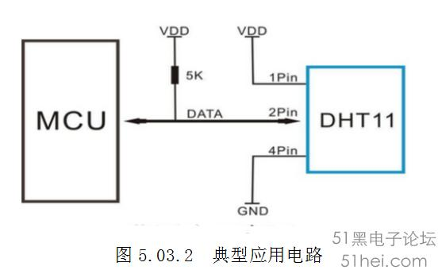
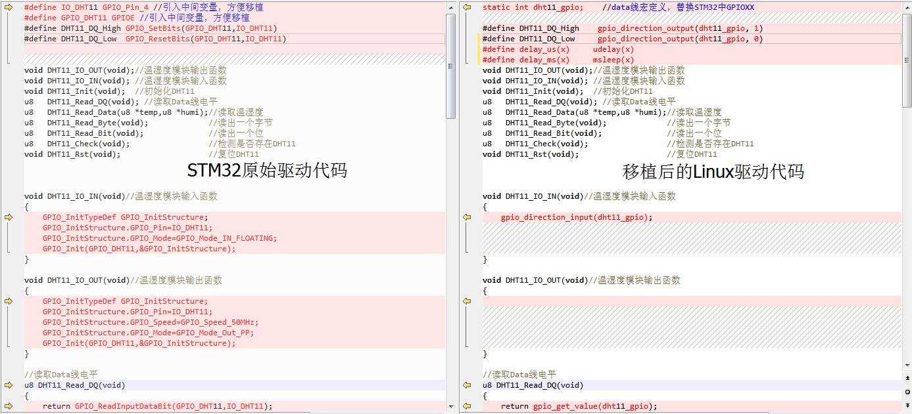

[TOC]

*****
## **1. 写在前面**
经过前面的章节，可能我们可以看到从一个普通外设到驱动的编写，应用层的测试，其实对于同是ARM 的芯片，但却是不同系列，又或者操作系统不一致，如RTOS与Linux之前，但是对于一个硬件外设来说，它的寄存器、操作时序等，不会因为主机的不同也发生变化。那么，这篇文章也是帮助一些具有一定的硬件开发能力的童鞋，将之前的成果快速地转化到ARM Linux开发环境上来，帮助其更好的理解ARM Linux环境下的开发；又或者给只有ARM Linux驱动开发的童鞋提供多一条思路，对于一些比较成熟的外设模块，在没有相同平台的Demo的情况下，快速地参考已经有的其他平台的例子，快速完成功能开发。
本章就以为**STM32**平台驱动温湿度**DHT11**为例，实现将单 片机驱动移植到ARM Linux下。

## **2. 硬件环境**
### **2.1 主控环境**
> 开发板：友善电子Nano Pi T4 
> 主控：RK3399(ARM V8)
> OS:Linux version 4.4.143
> 编译器：aarch64-linux-gnu-gcc (gcc version 7.3.0)
### **2.2 外设环境**
DHT11 数字温湿度传感器是一款含有已校准数字信号输出的温湿度复合传感器。
> 1． 供电电压：3-5.5V
> 
> 2． 供电电流：最大2.5mA
> 
> 3． 温度范围：0-50℃ 误差±2℃
> 
> 4． 湿度范围：20-90%RH 误差±5%RH
> 
> 5． 响应时间: 1/e(63%) 6-30s
> 
> 6． 测量分辨率分别为 8bit（温度）、8bit（湿度）
> 
> 7． 采样周期间隔不得低于1 秒钟

## **3.硬件接线**
由于DHT11采用了单总线的方式，所以输入输出都是在DATA线上完成了，典型的接线图如下，一般将DATA线接至CPU的某个IO口上。


### **3.1 STM32接线**

:-: PE4－－－－>DATA线

### **3.2 RK3399接线**

:-: GPIO1_A0－－－－>DATA线

## **4. 移植原理**
对于DHT11这种外设来说，无非就是IO口上设为输入输出间切换，进而进行数据的读写操作。对IO的操作来说，STM32有提供一系列方便的库函数，如：

```
void GPIO_Init(GPIO_TypeDef* GPIOx, GPIO_InitTypeDef* GPIO_InitStruct);
void GPIO_StructInit(GPIO_InitTypeDef* GPIO_InitStruct);
uint8_t GPIO_ReadInputDataBit(GPIO_TypeDef* GPIOx, uint16_t GPIO_Pin);
uint16_t GPIO_ReadInputData(GPIO_TypeDef* GPIOx);
uint8_t GPIO_ReadOutputDataBit(GPIO_TypeDef* GPIOx, uint16_t GPIO_Pin);
uint16_t GPIO_ReadOutputData(GPIO_TypeDef* GPIOx);
void GPIO_SetBits(GPIO_TypeDef* GPIOx, uint16_t GPIO_Pin);
void GPIO_ResetBits(GPIO_TypeDef* GPIOx, uint16_t GPIO_Pin);
void GPIO_WriteBit(GPIO_TypeDef* GPIOx, uint16_t GPIO_Pin, BitAction BitVal);
void GPIO_Write(GPIO_TypeDef* GPIOx, uint16_t PortVal);
```
对于linux来说，同样，有一系列方便的接口，与STM32库函数不同的是，这些接口是经过高度抽象化的，不直接操作硬件。

```
enum of_gpio_flags {
     OF_GPIO_ACTIVE_LOW = 0x1,
};  
int of_get_named_gpio_flags(struct device_node *np, const char *propname,   
int index, enum of_gpio_flags *flags);  
int gpio_is_valid(int gpio);  
int gpio_request(unsigned gpio, const char *label);  
void gpio_free(unsigned gpio);  
int gpio_direction_input(int gpio);  
int gpio_direction_output(int gpio, int v);
```

除此之外，对于外设驱动来说，除了IO控制之外，还必须对时序有严格的要求，比如说延时，那么，对于一定MCU来说有类似STM32 滴答时钟实现的延时，其实，在linux驱动来说，也有提供这些类似的接口。
所以，综上，我们从单片机移植一个驱动到Linux环境下，无非就是将接口进行替换。

## **5.  移植操作**
### **5.1  从设备树中传入GPIO口定义**
从上文，我们知道，其实操作Linux下的GPIO无非就是通过GPIO的API进行操作，那么，我们大可直接使用`gpio_direction_output(12,1)` 来实现IO直接操作，但是在ARM Linux上呢，我们可以通过设备树的方式，灵活的传入 `12` 这个编号，对于本次例程，我使用了之前的GPIO-LED方式的GPIO，设备树大概如下：
```
myleds: mygpio-leds {
 compatible = "mygpio-leds";
 pinctrl-names = "default";
 pinctrl-0 =<&myleds_gpio>;

 led@1 {
         gpios = <&gpio1 0 GPIO_ACTIVE_HIGH>;
         label = "my_led";
         linux,default-trigger = "heartbeat";
         linux,default-trigger-delay-ms = <0>;
        };
 };
 mygpio-leds {
 myleds_gpio: myleds-gpio {
         rockchip,pins = <1 0 RK_FUNC_GPIO &pcfg_pull_none>;
     };
 };
```

所以我们需要在驱动添加获取到这个GPIO的定义：` gpios = <&gpio1 0 GPIO_ACTIVE_HIGH>;`

首先，按照前面的章节所介绍的，我们只需要构建好我们的设备树结构体，然后，将名字与`compatible = "mygpio-leds"`   中的 "mygpio-leds" 一致即可，看下面示例：
```
static const struct of_device_id of_dht11_match[] = {
	{ .compatible = "mygpio-leds", },
	{},
};

MODULE_DEVICE_TABLE(of, of_dht11_match);
```
最后使用的`MODULE_DEVICE_TABLE`  将我们的结构体添加到内核的设备树的链表中去。

最后，我们需要构建一个drivers将我们的驱动注册到内核中去，让内核去匹配，这里使用一个platform 驱动为例：
```
static struct platform_driver dht11_driver = {
	.probe		= dht11_probe,
	.remove		= dht11_remove,
	.shutdown	= dht11_shutdown,
	.driver		= {
		.name	= "dht11_driver",
		.of_match_table = of_dht11_match,
	},
};

module_platform_driver(dht11_driver);
```
注意，也要把刚才说的设备树的结构体附给这个driver,如上代码片段所示的：

```
.driver		= {
		.name	= "dht11_driver",
		.of_match_table = of_dht11_match,
}
```

按照之前的方法，当设备树中的节点信息与driver匹配 后，会调用probe函数，那我们就可以在probe函数中，将` gpios = <&gpio1 0 GPIO_ACTIVE_HIGH>;`   取出来，利用一些设备树的API，代码如下：
```
struct device_node *dht11_gpio_node = pdev->dev.of_node; 
```
此时，dht11_gpio_node  就取出`myleds: mygpio-leds` 这个主节点，然后需要找出这个子节点：` led@1` 所以，真正的节点的是`dht11_gpio_node->child`   所以使用起来的效果是这样的：
```
dht11_gpio = of_get_named_gpio_flags(dht11_gpio_node->child, "gpios", 0, &flag); 
```
其中，`dht11_gpio` 就是我们要使用的GPIO的定义，按设备树的定义来说，就是` gpios = <&gpio1 0 GPIO_ACTIVE_HIGH>;`  如果不出问题的话，`dht11_gpio＝32` 

一旦得到GPIO号之后，我们就可以使之前提及的GPIO输出输入控制接口，所以最终，在probe函数中可以初步写成如下：

```
static int dht11_probe(struct platform_device *pdev)
{
	int ret;  
	enum of_gpio_flags flag;//(flag == OF_GPIO_ACTIVE_LOW) ?

	printk("-------%s-------------\n", __FUNCTION__);
	
    struct device_node *dht11_gpio_node = pdev->dev.of_node; 
	
	dht11_gpio = of_get_named_gpio_flags(dht11_gpio_node->child, "gpios", 0, &flag); 

	if (!gpio_is_valid(dht11_gpio)) 
	{
    	printk("dht11-gpio: %d is invalid\n", dht11_gpio); 
		return -ENODEV;
    }
	else
		printk("dht11-gpio: %d is valid!\n", dht11_gpio);
	if (gpio_request(dht11_gpio, "dht11-gpio")) 
	{ 
        printk("gpio %d request failed!\n", dht11_gpio); 
        gpio_free(dht11_gpio); 
        return -ENODEV;
    }
	else
		printk("gpio %d request success!\n", dht11_gpio); 
}
```

### **5.2  替换STM32中的接口**
按前文所述，就是将STM32中关于IO口操作的接口换成Linux中的，下面开始逐步分解

#### **5.2.1  替换宏定义接口**
我们先来看一下STM32中关于GPIO中操作的宏定义相关的：
```
#define IO_DHT11 GPIO_Pin_4 //引入中间变量，方便移植
#define GPIO_DHT11 GPIOE //引入中间变量，方便移植
#define DHT11_DQ_High GPIO_SetBits(GPIO_DHT11,IO_DHT11) 
#define DHT11_DQ_Low  GPIO_ResetBits(GPIO_DHT11,IO_DHT11)
```
替换成这样：
```
static int dht11_gpio;    //data线宏定义，替换STM32中GPIOXX
#define DHT11_DQ_High    gpio_direction_output(dht11_gpio, 1)
#define DHT11_DQ_Low     gpio_direction_output(dht11_gpio, 0)
```
这里的参数：`dht11_gpio` 就是前面通过设备树API从设备树中读到的。所以前面，为了方便，直接将其做了全局变量了。


#### **5.2.2  替换延时接口**
熟悉STM32单片机的童鞋一般都知道在STM32上使用的延时函数，一般是通过滴答（systick）实现的，为了移植过程中，替换代码量少，我直接将原代码中的接口宏定义了：
```
#define delay_us(x)		udelay(x)
#define delay_ms(x)		msleep(x)
```
#### **5.2.3  操作函数接口替换**
主要有以下的接口：
```
void DHT11_IO_OUT(void);//温湿度模块输出函数
void DHT11_IO_IN(void); //温湿度模块输入函数
void DHT11_Init(void);  //初始化DHT11
u8 DHT11_Read_DQ(void); //读取Data线电平
u8   DHT11_Read_Data(u8 *temp,u8 *humi);//读取温湿度
u8   DHT11_Read_Byte(void);             //读出一个字节
u8   DHT11_Read_Bit(void);              //读出一个位
u8   DHT11_Check(void);                 //检测是否存在DHT11
void DHT11_Rst(void);                   //复位DHT11  
```
下面来看一个个函数修改移植的效果

##### **5.2.3.1 void DHT11_IO_OUT(void) ;**
```
void DHT11_IO_OUT(void)//温湿度模块输出函数
{
    GPIO_InitTypeDef GPIO_InitStructure;
    GPIO_InitStructure.GPIO_Pin=IO_DHT11;
    GPIO_InitStructure.GPIO_Speed=GPIO_Speed_50MHz;
    GPIO_InitStructure.GPIO_Mode=GPIO_Mode_Out_PP;
    GPIO_Init(GPIO_DHT11,&GPIO_InitStructure);
}
```
替换：其实这个函数的作用无非就是将IO设为输出模式，然后使用`DHT11_DQ_High`    或者  `DHT11_DQ_Low`   输出高低电平，而我们移植的宏定义，已经实现了先设置为输出再输出高低电平，一步到位！

##### **5.2.3.2 void DHT11_IO_IN(void) ;**

STM32上原始的样子：
```
void DHT11_IO_IN(void)//温湿度模块输入函数
{
    GPIO_InitTypeDef GPIO_InitStructure;
 
    GPIO_InitStructure.GPIO_Pin=IO_DHT11;
    GPIO_InitStructure.GPIO_Mode=GPIO_Mode_IN_FLOATING;
    GPIO_Init(GPIO_DHT11,&GPIO_InitStructure);
}

```
替换成这样：
```
void DHT11_IO_IN(void)//温湿度模块输入函数
{
    gpio_direction_input(dht11_gpio);
}；
```

##### **5.2.3.3 u8 DHT11_Read_DQ(void);**
STM32上原始的样子：
```
u8 DHT11_Read_DQ(void)    
{
	return GPIO_ReadInputDataBit(GPIO_DHT11,IO_DHT11);
}

```
替换成：
```
static u8 DHT11_Read_DQ(void)    
{
	return gpio_get_value(dht11_gpio);
}
```

##### **5.2.3.4  总结对比**
到此时，我们可以发现其实对于比较上层一点的函数，其实函数基本上可以直接用了，因为我们完成了底层的接口的替换之后，代码基本上一致。下面就不再一一赘述这些函数了，我们可以直接看整个代码移植前后的对比图：



##### **5.2.3.5  其他直接无缝使用的的代码**
```
//复位DHT11
void DHT11_Rst(void)   
{                 
	DHT11_IO_OUT(); //SET OUTPUT
	DHT11_DQ_Low; //DQ=0
	delay_ms(20);    //拉低至少18ms
	DHT11_DQ_High; //DQ=1 
	delay_us(30);     //主机拉高20~40us
}
 
//等待DHT11的回应
//返回1:未检测到DHT11的存在
//返回0:存在
u8 DHT11_Check(void)    
{   
	u8 retry=0;//定义临时变量
	DHT11_IO_IN();//SET INPUT 
	while ((DHT11_Read_DQ()==1)&&retry<100)//DHT11会拉低40~80us
	{
		retry++;
		delay_us(1);
	}; 
	if(retry>=100)return 1;
	else retry=0;
    while ((DHT11_Read_DQ())==0)&&retry<100)//DHT11拉低后会再次拉高40~80us
	{
		retry++;
		delay_us(1);
	};
	if(retry>=100)return 1;    
	return 0;
}
//从DHT11读取一个位
//返回值：1/0
u8 DHT11_Read_Bit(void)  
{
	u8 retry=0;
	while((DHT11_Read_DQ()==1)&&retry<100)//等待变为低电平
	{
		retry++;
		delay_us(1);
	}
	retry=0;
	while((DHT11_Read_DQ()==0)&&retry<100)//等待变高电平
	{
		retry++;
		delay_us(1);
	}
	delay_us(40);//等待40us
	if(DHT11_Read_DQ()==1)
		return 1;
	else 
		return 0;   
}
//从DHT11读取一个字节
//返回值：读到的数据
u8 DHT11_Read_Byte(void)    
{        
    u8 i,dat;
    dat=0;
	for (i=0;i<8;i++) 
	{
		dat<<=1; 
		dat|=DHT11_Read_Bit();
	}    
	return dat;
}
 
//从DHT11读取一次数据
//temp:温度值(范围:0~50°)
//humi:湿度值(范围:20%~90%)
//返回值：0,正常;1,读取失败
u8 DHT11_Read_Data(u8 *temp,u8 *humi)    
{        
	u8 buf[5];
	u8 i;
	DHT11_Rst();
	if(DHT11_Check()==0)
	{
		for(i=0;i<5;i++)//读取40位数据
		{
		buf[i]=DHT11_Read_Byte();
		}
		if((buf[0]+buf[1]+buf[2]+buf[3])==buf[4])
		{
			*humi=buf[0];
			*temp=buf[2];
		}
	}else return 1;
	return 0;    
}
//初始化DHT11的IO口 DQ 同时检测DHT11的存在
//返回1:不存在
//返回0:存在     
void DHT11_Init(void)
{     
	DHT11_Rst();  //复位DHT11
	DHT11_Check();//等待DHT11的回应
}
```

## **6. 加入到字符设备驱动框架**

按照之前的教程，编写字符驱动框架，最终创建一个字符设备`/dev/dht11`供上层应用读写，主要在read函数中，调用`DHT11_Read_Data`，将读到的温湿度传给上层。
read函数效果大致如下：
```
static ssize_t DHT11_read(struct file *file, char __user *buf,
		    size_t nbytes, loff_t *ppos)
{	
	printk("--------------%s--------------\n",__FUNCTION__);
	
	dht11_data Last_dht11_data;
	if(DHT11_Read_Data(&Last_dht11_data.temp,&Last_dht11_data.hum) == 0);//读取温湿度值 
	{
		if ( copy_to_user(buf,&Last_dht11_data,sizeof(Last_dht11_data)) )
		{
			return EFAULT ;
		}
	}

}
....
static struct file_operations dht11_fops = {
	.owner = THIS_MODULE,
	.read = DHT11_read,
	.open = DHT11_open,
	.release = DHT11_close,
};
......
```


## **7. 测试代码**

```
#include <stdio.h>
#include <stdlib.h>
#include <unistd.h>
#include <sys/types.h>
#include <sys/stat.h>
#include <fcntl.h>
#include <errno.h>


typedef unsigned char u8;
typedef unsigned short u16;

typedef struct	DHT11_SENSOR_DATA
{
	u16 temp;//温度
	u16 hum;//湿度
}dht11_data;

int main ( void )
{
	int fd ;
	int retval ;
	dht11_data Curdht11_data;
	fd = open ( "/dev/dht11" , O_RDONLY) ;
	if ( fd == -1 )
	{
		perror ( "open dht11 error\n" ) ;
		exit ( -1 ) ;
	}
	printf ( "open /dev/dht11 successfully\n" ) ;
	sleep ( 2 ) ;
	while ( 1 )
	{
		sleep ( 1 ) ;
		retval = read ( fd , &Curdht11_data , sizeof(Curdht11_data) );
		if ( retval == -1 )
		{
			perror ( "read dht11 error" ) ;
			printf ( "read dht11 error" ) ;
			exit ( -1 ) ;
		}
		if(Curdht11_data.temp != 0xffff)
			printf ( "Temperature:%d.%d C,Humidity:%d.%d %%RH\n",Curdht11_data.temp>>8,Curdht11_data.temp&0xff,\
																 Curdht11_data.hum>>8,Curdht11_data.hum&0xff ) ;
	}
	close ( fd ) ;
}
```
## **8.  测试效果**


## **9.  代码开源地址**

[Github](https://github.com/jackeyt/DHT11-for-RK3399-driver)


